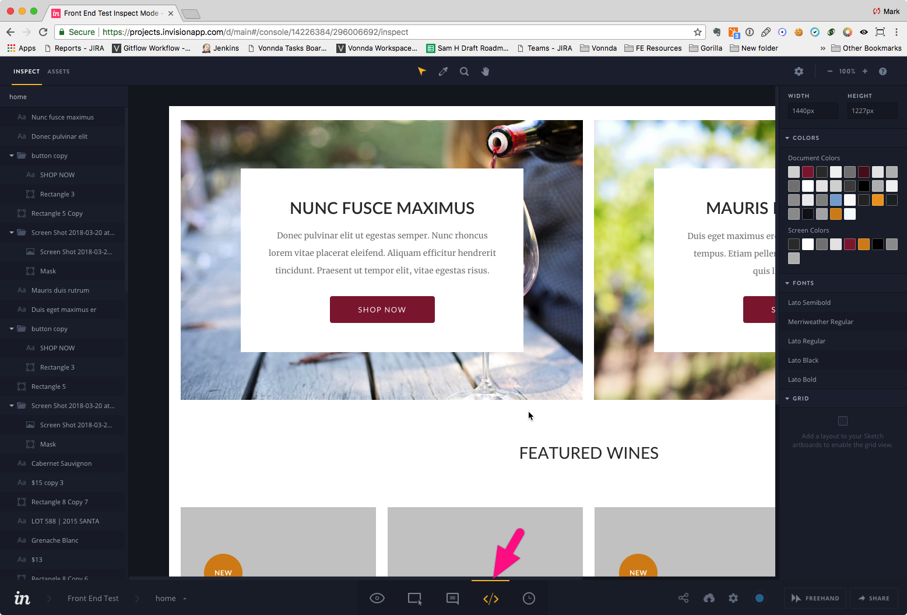

Front End Test Project
======================

## Project brief
Convert the following designs to HTML/CSS/JS.

### Thumbnail

## Requirements
1. Use HTML5 / SCSS
2. Make it responsive using your best judgement.
3. Create a simple custom JS effect of your choice - use only vanilla JavaScript, do not use jQuery or any other external libraries for it.
4. Create some hover effect for the product images.
5. Make the page the smallest possible size - ensure that images are properly optimized, resources minified, etc.
6. *Optional bonus task 1:* Use [responsive images](https://developer.mozilla.org/en-US/docs/Learn/HTML/Multimedia_and_embedding/Responsive_images)

## Invision App (Design)
[Project Design](https://projects.invisionapp.com/d/main#/console/14226384/296006692/inspect)

*Invision App Tip:* Use the inspector view to get appropriate dimensions and other details from the design.

- The fonts used in the design are Lato and Merriweather
  - https://fonts.google.com/specimen/Lato?selection.family=Lato|Merriweather
- The following images are used in the design:
  -  https://www.pexels.com/photo/grapes-vineyard-vine-purple-grapes-39511/
  -  https://www.pexels.com/photo/adult-alcohol-blur-celebrate-290316/

## Supported browsers
Ensure that the elements work and display correctly in the following browsers:

- Desktop
  - Firefox (latest version)
  - Google Chrome (latest version)
  - Microsoft Edge
  - Internet Explorer 11
- Tablet / Mobile
  - Safari
  - Chrome
  
## Coding Standards
When working on the project use consistent coding style. You can also check guidelines like [Code Guide](http://codeguide.co/) or [CSS Guidelines](http://cssguidelin.es/). *Optional bonus task 2:* Use [BEM Methodology](https://en.bem.info/methodology/)

## Quality Assurance

What you need to do to get high QA score? Simply answer **Yes** to all these questions:

### General

- Are all requirements set above met?
- Is the page working without any JS errors?

### Precision

- Is reasonable precision achieved?

### Browser check

- Does page display and work correctly in supported browsers?

### Valid HTML

- Is the page valid?

### Semantic Markup

- Are the correct tags being used?

### Coding Standards

- Is the page using a consistent HTML coding style?
- Is the page using a consistent CSS coding style?
- Is the page using a consistent JS coding style?

### Optimization

- Are image files sufficiently compressed?
- Is CSS and JS concatenated and minified? 

### Accessibility

- Are proper ALT attributes for images provided?
- Are ARIA attributes properly used?
- Is proper heading structure in place?
